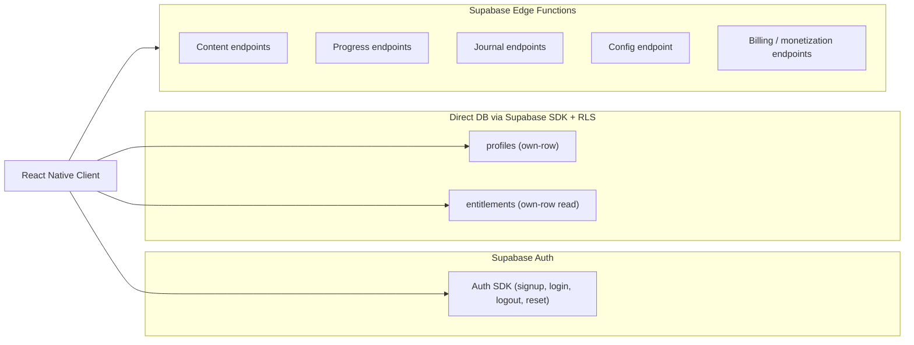
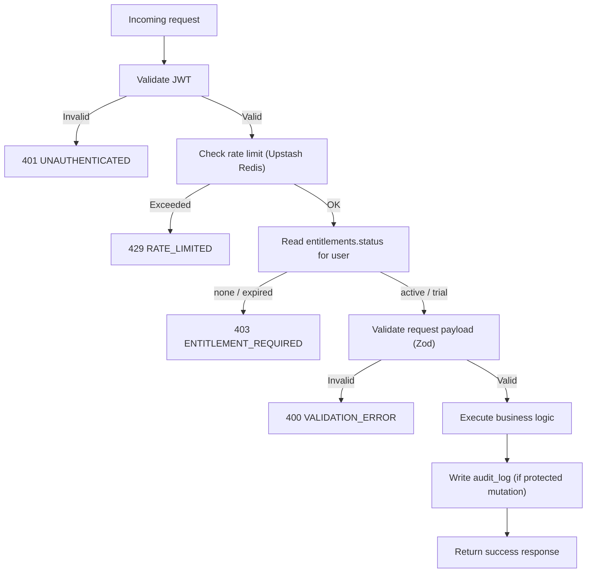

# Relentless — Endpoint Inventory (Phase 2)

**Status:** Draft for review. Do not implement until approved.

**Source of truth:** `docs/PRD_relentless.md` (§12, §13, §14, §16, §21)
**Schema reference:** `docs/schema_plan.md`

This document inventories every access path between the client and backend,
classifies each one per PRD §16, and assigns security/rate-limit/validation
requirements per PRD §13. It does not define implementation details, exact
thresholds, or any product behavior not confirmed in the PRD.

---

## Access pattern summary

The app has three distinct access patterns. Understanding which pattern each
operation uses is critical because it determines where auth, entitlement,
rate-limit, and validation enforcement happen.



### Pattern 1: Supabase Auth SDK (not custom endpoints)

Auth operations use the Supabase Auth client SDK directly. These are not
custom Edge Functions and are not part of the endpoint inventory. Rate
limiting is handled by Supabase's built-in auth rate limits.

- Signup (`supabase.auth.signUp`)
- Login (`supabase.auth.signInWithPassword`)
- Logout (`supabase.auth.signOut`)
- Password reset (`supabase.auth.resetPasswordForEmail`)

The `handle_new_user()` trigger (Migration 1) auto-creates `profiles` and
`entitlements` rows on signup. No custom endpoint is needed.

### Pattern 2: Direct DB via Supabase client SDK + RLS

These operations use the Supabase client SDK with the user's JWT. RLS
policies restrict access to the user's own row. No Edge Function is
involved.

| Operation | Table | RLS policy | Notes |
|---|---|---|---|
| Read own profile | `profiles` | `auth.uid() = id` | Identity and competition_date |
| Update own profile | `profiles` | `auth.uid() = id` | competition_date, onboarding_completed |
| Read own entitlement | `entitlements` | `auth.uid() = user_id` | Subscription status for client UX gating |

These are not Edge Functions and do not appear in the endpoint inventory
below. Rate limiting for direct DB access is handled at the Supabase
project level and by Upstash Redis middleware if needed.

### Pattern 3: Supabase Edge Functions (custom backend endpoints)

All other operations go through Edge Functions. Every Edge Function uses
the service-role key to access the database, verifies the user's JWT,
checks entitlement where required, and returns a standardized response.

These are the endpoints inventoried below.

---

## Endpoint classes (per PRD §16)

| Class | Description | Auth | Entitlement check | Rate-limit tier |
|---|---|---|---|---|
| Authenticated read | Read for any logged-in user | JWT required | No | Standard |
| Entitlement-protected read | Read for active subscribers | JWT required | Yes | Standard |
| Entitlement-protected write | Write for active subscribers | JWT required | Yes | Tighter |
| Billing / monetization | Purchase-related operations | JWT or server signature | Varies | Strict |
| Server-to-server | Webhook receivers | Provider signature | N/A | Separate |
| Admin-only | Support / management tools | TBD | N/A | TBD |

No `public read` (unauthenticated) endpoints exist in V1. All endpoints
require authentication at minimum. Pre-paywall endpoints (O1, F1) use the
`Authenticated read` class — they require a valid JWT but not an active
entitlement.

---

## Endpoint inventory

### Content endpoints

| # | Endpoint | Method | Class | Entitlement | Idempotent | Bounds | Description |
|---|---|---|---|---|---|---|---|
| C1 | `/lessons` | GET | Entitlement-protected read | Required | N/A | Paginated; default/max page size TBD | List published lessons in sequence order; **403 `LIBRARY_LOCKED`** until the user has completed at least one scheduled program lesson (see `computeLibraryUnlocked`) |
| C2 | `/lessons/:id` | GET | Entitlement-protected read | Required | N/A | — | Get single lesson detail |
| C3 | `/lessons/next` | GET | Entitlement-protected read | Required | N/A | — | Get the Daily Workout lesson for `profiles.current_program_day` via `program_schedule` (v1); response includes `program_day`, `program_version`; when the user has completed today's WOD, `repeat_lesson` (metadata object) is included alongside `data` so the client can offer a durable repeat without local state |
| C4 | `/coaches/:id` | GET | Entitlement-protected read | Required | N/A | — | Get coach metadata (name, bio, external_url) |

**Notes:**
- C1 returns lesson metadata only. Voiceover/audio assets live in
  backend-managed storage. Exact delivery mechanics (signed URLs, CDN, or
  other controlled access pattern) remain TBD.
- C3 uses the explicit 30-day `program_schedule` (per `program_version`, default
  `v1`) and `profiles.current_program_day` (1–30). Completing the scheduled
  lesson for that day advances `current_program_day` (capped at 30) inside
  `complete_lesson`. Final per-day lesson mapping is content-owned; replace
  schedule rows when the real 30-day doc is available.
- V1 has one coach. C4 is included for architecture completeness; the
  client could also embed coach info in lesson responses.

### Onboarding endpoints

| # | Endpoint | Method | Class | Entitlement | Idempotent | Bounds | Description |
|---|---|---|---|---|---|---|---|
| O1 | `/onboarding/sample-lesson` | GET | Authenticated read | Not required | N/A | — | Serve the onboarding sample exercise before the paywall |

**Notes:**
- O1 provides a pre-paywall access path for the onboarding sample exercise
  (PRD §6). This is explicitly separate from premium content endpoints
  (C1–C4), which all require an active entitlement.
- The sample exercise is shown during onboarding before the user has
  subscribed. It must not use the same entitlement-protected access path
  as premium content.
- Exact implementation (dedicated endpoint, hardcoded content ID, separate
  content bucket, or other pattern) remains TBD.

### Progress endpoints

| # | Endpoint | Method | Class | Entitlement | Idempotent | Bounds | Description |
|---|---|---|---|---|---|---|---|
| P1 | `/lessons/:id/complete` | POST | Entitlement-protected write | Required | Idempotency key | — | Record lesson completion; triggers progress and streak updates |
| P2 | `/progress` | GET | Entitlement-protected read | Required | N/A | — | Get own MAC scores; includes **`library_unlocked`** (scheduled program lesson completed at least once) |
| P3 | `/streak` | GET | Entitlement-protected read | Required | N/A | — | Get own streak state (current, longest, last activity) |

**Notes:**
- P1 is the most important write endpoint in V1. It creates a
  `user_lesson_completions` row, updates `user_progress`, and updates
  `user_streaks` — all as a single atomic backend operation (PRD §12.5).
- P1 uses an idempotency key to prevent duplicate submissions from network
  retries. Intentional re-completions (different idempotency keys) are
  allowed per schema plan.
- P1 progress and streak update logic is TBD. The endpoint structure
  exists, but the scoring formula and streak reset rule are unresolved.

### Journal endpoints

| # | Endpoint | Method | Class | Entitlement | Idempotent | Bounds | Description |
|---|---|---|---|---|---|---|---|
| J1 | `/journal` | POST | Entitlement-protected write | Required | No | — | Create a journal entry (optionally tied to lesson or competition date) |
| J2 | `/journal` | GET | Entitlement-protected read | Required | N/A | Paginated; chronological; default/max page size TBD | List own journal entries |
| J2b | `/journal/:id` | GET | Entitlement-protected read | Required | N/A | — | Fetch one own journal entry (same item shape as list rows) |
| J3 | `/journal/:id` | PATCH | Entitlement-protected write | Required | No | — | Update own journal entry body |
| J4 | `/journal/:id` | DELETE | Entitlement-protected write | Required | No | — | Delete own journal entry |

**Notes:**
- All journal endpoints enforce ownership: the Edge Function verifies
  `journal_entries.user_id = auth.uid()` before any operation.
- J1 does not require an idempotency key because journal entries are
  user-authored content, not protected state mutations. Can be added later
  if duplicate-submission protection is desired.

### Configuration endpoint

| # | Endpoint | Method | Class | Entitlement | Idempotent | Bounds | Description |
|---|---|---|---|---|---|---|---|
| F1 | `/config` | GET | Authenticated read | Not required | N/A | — | Get resolved feature flags / client configuration |

**Notes:**
- F1 does NOT require an active entitlement. The client needs
  configuration before the paywall (e.g., during onboarding).
- The backend evaluates `feature_flags` rows and returns only the resolved
  key/enabled/metadata the client needs. The raw `feature_flags` table is
  never exposed.
- Cacheable: the response can be cached per-user or globally depending on
  flag targeting.

### Monetization endpoints

| # | Endpoint | Method | Class | Entitlement | Idempotent | Bounds | Description |
|---|---|---|---|---|---|---|---|
| B2 | `/purchases/restore` | POST | Billing / monetization | JWT required | Yes | — | Restore purchases; verifies receipt with Apple, updates entitlements |

**Notes:**
- B2 is a required monetization capability (PRD §10, §14.4). Purchase
  restoration must be supported from launch.
- Implementation path is TBD. Restore behavior should align with
  Apple-compliant IAP behavior and verified entitlement state.
- B2 is idempotent: repeated restores with the same receipt must not
  double-grant access. Uses the `idempotency_keys` table.

### Deferred endpoints

These endpoints are defined in the PRD but not yet scheduled for implementation.

| # | Endpoint | Method | Class | Phase | Description |
|---|---|---|---|---|---|
| B1 | `/billing/apple-webhook` | POST | Server-to-server | 3 | Apple Server Notification v2 receiver; verifies signature, updates entitlements idempotently |
| A1 | Admin endpoints | TBD | Admin-only | 5+ | Support tools, manual adjustments — scope TBD |

---

## Standard error envelope

Every Edge Function returns errors in a consistent shape (PRD §13.5, §16):

```
{
  "error": {
    "code": "<STABLE_CODE>",
    "message": "<human-readable description>",
    "request_id": "<uuid>"
  }
}
```

### Stable error codes

| Code | HTTP status | Meaning |
|---|---|---|
| `UNAUTHENTICATED` | 401 | Missing or invalid JWT |
| `ENTITLEMENT_REQUIRED` | 403 | Valid JWT but no active subscription |
| `FORBIDDEN` | 403 | Valid JWT but not the resource owner |
| `NOT_FOUND` | 404 | Resource does not exist |
| `VALIDATION_ERROR` | 400 | Request body/params failed schema validation |
| `RATE_LIMITED` | 429 | Rate limit exceeded; include `Retry-After` header |
| `IDEMPOTENCY_CONFLICT` | 409 | Idempotency key already used with different params |
| `INTERNAL_ERROR` | 500 | Unexpected server error |

All error responses include a `request_id` for tracing (PRD §13.6).

---

## Rate-limit class definitions

Per PRD §13.1, rate limiting exists at multiple layers. Numerical
thresholds are defined per endpoint group at implementation time.

| Class | Layer | Relative strictness | Applies to |
|---|---|---|---|
| `auth` | IP + user | Strict | Supabase-managed auth endpoints |
| `authenticated-read` | User + IP | Standard | C1–C4, O1, P2, P3, J2, F1 |
| `authenticated-write` | User + IP | Tighter than read | P1, J1, J3, J4 |
| `billing` | User + IP | Strict | B2 |
| `server-to-server` | IP + signature | Separate | B1 (Phase 3) |

**Rate-limit infrastructure:** Upstash Redis (per PRD §11). Edge Functions
check rate limits via Upstash before processing requests. 429 responses
include a stable `RATE_LIMITED` error code and `Retry-After` guidance.

---

## Validation and bounds rules

Per PRD §13.2 and §13.5, every endpoint enforces strict validation:

- **Request schemas:** every endpoint has an explicit Zod schema for
  request body/params. Unknown fields are rejected.
- **Payload size caps:** enforced at the Edge Function level.
- **List/search bounds:**
  - Default page size: TBD
  - Max page size: TBD
  - Allowed sort fields: explicit allowlist per endpoint
  - Allowed filter fields: explicit allowlist per endpoint
  - No unbounded scans or user-controlled arbitrary query expansion
- **Protected values are server-derived:** the client cannot submit
  entitlement status, progress scores, streak counts, or timestamps that
  affect protected logic.

---

## Ownership enforcement

Every endpoint that operates on user-owned data verifies ownership
server-side (PRD §13.3):

| Endpoint group | Ownership check |
|---|---|
| Content (C1–C4) | N/A — content is shared, not user-owned |
| Onboarding (O1) | N/A — pre-paywall sample content |
| Progress (P1–P3) | `user_id = auth.uid()` — derived from JWT, never client-supplied |
| Journal (J1–J4) | `user_id = auth.uid()` on create; `user_id = auth.uid()` check on read/update/delete |
| Config (F1) | N/A — flags are global or environment-scoped |
| Monetization (B2) | Derived from JWT — restore applies to the requesting user only |

The client never supplies a `user_id`. It is always derived from the JWT.

---

## Idempotency requirements

Per PRD §13.4, any endpoint that changes protected state must be idempotent
where applicable.

| Endpoint | Idempotency key required | Reason |
|---|---|---|
| P1 (`POST /lessons/:id/complete`) | Yes | Affects progress and streak (protected state) |
| B2 (`POST /purchases/restore`) | Yes | Affects entitlements (billing state) |
| B1 (`POST /billing/apple-webhook`) | Yes (deferred) | Affects entitlements (billing state) |
| J1 (`POST /journal`) | No | User-authored content, not protected state |
| J3 (`PATCH /journal/:id`) | No | Last-write-wins is acceptable for journal edits |
| J4 (`DELETE /journal/:id`) | No | Already naturally idempotent (delete non-existent = no-op) |

Idempotent endpoints use the `idempotency_keys` table. The Edge Function
checks for an existing key before processing and returns the cached
response on replay.

---

## Entitlement check flow

Every entitlement-protected endpoint follows this flow:



The entitlement check reads from `entitlements` using the service-role key
(bypassing RLS). Access-valid statuses: `trial`, `active`. Not
access-valid: `none`, `expired`. The full entitlement state model should
not be over-specified beyond this until subscription offerings are decided.

---

## Open questions

1. **Lesson detail scope.** Should C2 (`/lessons/:id`) return full lesson
   content (on-screen text, signed voiceover URL) or just metadata? Exact
   delivery mechanics for voiceover assets from backend-managed storage
   remain TBD.

2. **Combined state endpoint.** Should P2 (`/progress`) and P3 (`/streak`)
   be combined into a single "user state" endpoint to reduce client round
   trips? Or kept separate for clarity?

3. **Coach endpoint necessity.** V1 has one coach. Is C4 needed as a
   standalone endpoint, or should coach info be embedded in lesson
   responses?

4. **Onboarding sample exercise implementation.** O1 is confirmed as a
   separate pre-paywall access path. Exact implementation pattern
   (dedicated endpoint, hardcoded content ID, separate content bucket)
   remains TBD.

---

## Confirmed decisions

| # | Decision | Resolution |
|---|---|---|
| 1 | Onboarding sample exercise access | Separate pre-paywall access path (O1); exact implementation TBD |
| 2 | Voiceover asset storage | Backend-managed storage; exact delivery mechanics (signed URLs, CDN, other) TBD |
| 3 | Entitlement check values | `trial` and `active` = access-valid; `none` and `expired` = not access-valid |
| 4 | Restore purchases | Required monetization capability (B2); not deferred |

## Human Input Needed

| # | Decision | Blocks |
|---|---|---|
| 1 | Exact voiceover delivery mechanics (signed URLs, CDN, other controlled access pattern) | Lesson detail response shape |
| 2 | Default and max page sizes for list endpoints | Pagination implementation |
| 3 | Rate-limit numerical thresholds per endpoint class | Rate-limit configuration in Upstash |
| 4 | Onboarding sample exercise implementation pattern (dedicated endpoint, hardcoded ID, content bucket) | O1 implementation |

Items from the schema plan that remain TBD and also affect endpoints:

| # | Item | Endpoint impact |
|---|---|---|
| 5 | Progress scoring formula | P1 business logic |
| 6 | Streak reset rule | P1 business logic |
| 7 | Exact post-expiration UX | Client gating around 403 responses |
| 8 | Lesson interaction subtypes | Lesson response shape |

---

## What remains unimplemented

- All Edge Function code
- All Zod validation schemas
- Rate-limit middleware (Upstash Redis)
- Idempotency middleware
- Entitlement check middleware
- Apple webhook endpoint (B1, Phase 3)
- Admin endpoints (A1, Phase 5+)
- Exact rate-limit thresholds
- Exact pagination defaults
- Scoring and streak logic
- Onboarding flow and sample exercise delivery
- Paywall integration
- Voiceover asset delivery pipeline
- Client-side API layer
